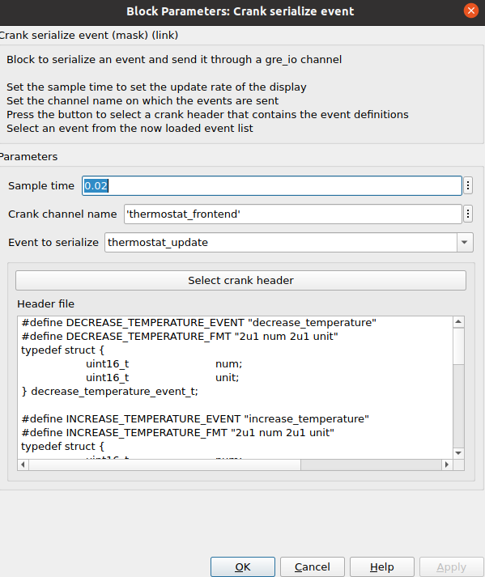

# GOcontroll-Simulink-Crank-Storyboard
A Simulink toolbox for working with a Crank Storyboard UI.  
Currently only targets that use the elf format can be used, see the open issue.

## Setup
Notice: If you are working with multiple Matlab versions on your system, It is recommended to change the default addon location.  
This can be done in the home tab of **Matlab** -> **preferences** (environment section) -> **MATLAB** -> **Add-Ons**.  
Change the installation folder to something like "MATLAB*your matlab version*_addons", do this for all your Matlab installations.  
This way it is easier to maintain version compatibility between toolboxes and Matlab. For more info see [the help page](https://nl.mathworks.com/help/matlab/matlab_env/get-add-ons.html).  

To compile some necessary mex files on Windows you may need to install the "MATLAB Support for MinGW-w64 C/C++/Fortran Compiler" add-on from the Matlab add-on explorer.

To install, for now download the latest version from the github releases page.
In the future:
Download the Crank-Storyboard-Simulink add-on from the Matlab add-on explorer.

Create a crank_files folder in your project root:
``` text
.
├── blockset
├── crank_files
├── GOcontroll_Linux.slx
├── GOcontroll_Linux_startup.m
├── librarySetup.m
```
This toolbox does not provide the appropriate Crank header/library, you will have to provide this yourself.  
The crank_files folder will contain your Crank related files, greio.h, greio.a and event descriptions.  
``` text
./crank_files
├── event_definitions.h
├── crank_header.h
├── crank_lib.a
```
An example of the event description file can be found in the example_code directory.  
The format of an event in this file is important for the parser and should look like this:
``` h
#define <EVENT_NAME>_EVENT "<event_name>"
#define <EVENT_NAME>_FMT "2u1 field_name1 2u2 field_name2"
typedef struct {
	uint16_t 		field_name1;    // type and name can be customized as desired, but need to be on one line
	uint16_t 		field_name2[2]; // allowed types: double, float, int8_t, uint8_t, int16_t, uint16_t, int32_t, uint32_t
} <event_name>_event_t;
```
If an event has no data attached to it you only have to put in the first #define, see the example file.  

It might be nice to split your receive channel events and your send channel events into 2 seperate header files.  
It will make deserializing more efficient as it doesn't have to try to strncmp event that will never be deserialized.  

## Usage

### Receiving events in Simulink
Place a Crank receive channel block, then attach a function call subsystem to it and have the event be an input to this subsystem.  

  

Open the block, set the channel name, buffer size and import the header file containing the events.  
  
  

Then place any number of Crank deserialize event blocks in this subsystem to get the event info.

  

After connecting the event line (this allows the deserialize block to find the events loaded into the receive block), open the block and set the event to decode.  


This will automatically adjust the outputs of the block to the right signals.

### Sending events from Simulink
Place a Crank serialize event block.  

  

Open the block, set the channel name and import the header file containing the events to be serialized, then select the desired event to serialize.  



The inputs of the block will now be adjusted to this event.

### Notes

The first startup might take some time as it needs to compile some MEX files.  
This blockset is made using 2023b, it might work with 2024a.

## Examples

An example is present in the library that runs as the backend for the ThermostatIO demo.  
Simply start a new simulink project, drag the example from the library into your model, add the crank_files folder with the necessary files (libgreio.a libgreio.h ThermostatIO_events.h).
Then build with the toolchain of your choice, this toolbox is maintained mainly for the [GOcontroll-Simulink](https://github.com/GOcontroll/GOcontroll-Simulink), that one is pretty much guaranteed to work but is meant specifically for the GOcontroll Moduline controllers.

To modify the example open the Crank Storyboard library, disable the library lock, then disable the link to the example subsystem.

## Contributing

If you have a toolchain that should work but it doesn't, make an issue describing the error, or file a pull request with the fix.  
The goal is to have this work on any platform, windows, linux, mac. So when describing file paths use fullfile() or ['path' filesep 'other path'].